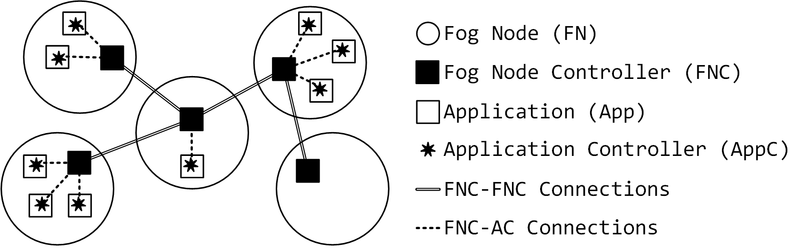

## An Architecture to Support Autonomic Data Stream Processing Applications in the Fog

The high-level architecture for supporting autonomic data
stream parallel applications in the fog is shown below composed by the following components:
 - **Fog Nodes (FNs)**: are devices (e.g., smartphones, laptops, routers) where the containerized Stream parallel Application are executed,
 - **Fog Node Controllers (FNCs)**: (containerized) component used for  scaling up/down the resources (CPU, memory) utilized by the applications,
 - **Autonomic applications (Apps)**: any kind of parallel stream application,
 - **Autonomic application Controllers (AppCs)**: autonomic logic inside the application responsible to control the parallel application.


<p align="center">

</p>

## Preliminary results
In this section we illustrate how Docker can be used to manage the resources in a *FN* (*intra-fog* scenario) and to checkpoint an *App* (*inter-fog* scenario).

- [**intra-fog**](./intra-fog) experiment
- [**intra-fog**](./inter-fog) experiment


```


### FastFLow and fog
We are investigating the possibility to execute FastFlow (FF) programs in Docker containers.

There are two main aspects that we want to achieve:
- **elasticity**:  the resources (CPU, Memory) needed by FF programs can change over time (e.g. increasing the number of workers in a farm). It is possible to dynamically allocate resources associated to a Docker container running a FF program ?
- **multi-tenant**: if two FF programs are executed on the same host they can reduce or impact the overall performance because each program gains (in a greedy way) as much as possible the available resource. It is possible to run FF program in isolated Docker containers in such a way the don't interfere with each others ? -->
